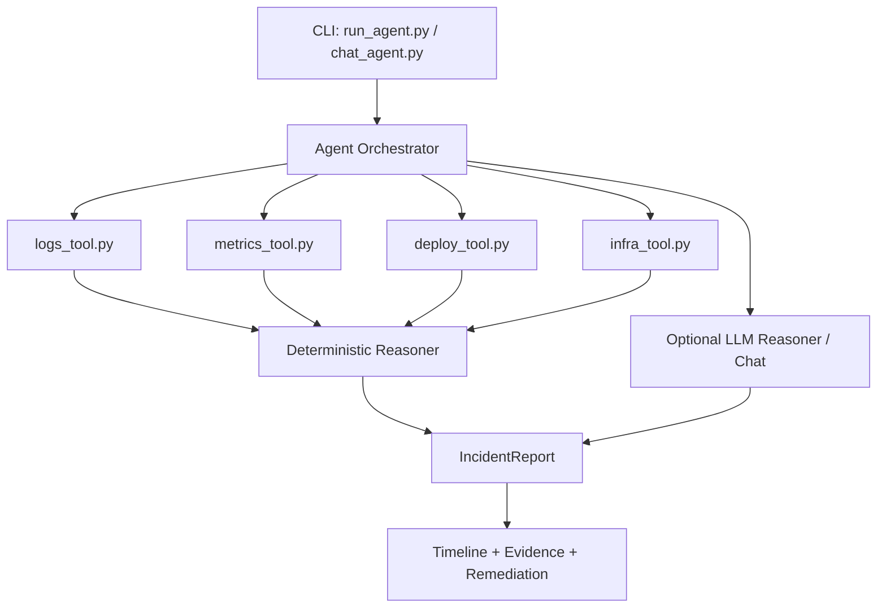

# Infra Sherlock

Infra Sherlock is an AI-powered incident investigation tool that simulates how an SRE analyzes production outages by correlating logs, metrics, deploy history, and infrastructure changes.

Local-first by default, demo-ready in a terminal, and designed for portfolio/interview walkthroughs.


## Why It Matters

Infra Sherlock demonstrates practical incident response engineering without requiring production cloud accounts.

- Correlates multi-signal telemetry (logs, metrics, deploys, infra changes)
- Produces structured root-cause reports with confidence and timeline
- Supports deterministic fallback for fully offline/local demos
- Supports optional provider-backed chat (OpenAI/OpenRouter)

## Chat Demo

Run interactive chat:

```bash
python cli/chat_agent.py payments_db_timeout
```

Example:

```text
> what happened?
payments-api degraded due to DB connectivity issues after a network security change.
Most likely cause: DB ingress restriction introduced connectivity delays.
Confidence: 0.99

> timeline
09:54 Deploy 2026.03.06.1 to payments-api
09:58 Infra change restricted inbound DB access
10:04 First DB timeout error observed

> why do we think its network?
- 5 database timeout log events
- error rate increased to 4.10%
- p95 latency increased to 1280ms
- infra change modified DB ingress rules
```

Built-in chat shortcuts:

- `/summary`
- `/root`
- `/timeline`
- `/evidence`
- `/remediation`
- `/help`
- `/exit`
- `/export <file.md>`

## CLI Commands

Investigation report:

```bash
python cli/run_agent.py investigate payments_db_timeout
```

Markdown export:

```bash
python cli/run_agent.py investigate payments_db_timeout --output reports/payments_db_timeout.md
```

Quiet export:

```bash
python cli/run_agent.py investigate payments_db_timeout --output reports/payments_db_timeout.md --quiet
```

Major-incident triage:

```bash
python cli/major_incident.py triage payments_sev1_march_2026
```

Major-incident command chat:

```bash
python cli/chat_major_incident.py payments_sev1_march_2026
```

Major-incident chat commands:

- `/overview`
- `/services`
- `/blast-radius`
- `/timeline`
- `/hypotheses`
- `/service <service_name>`
- `/next-steps`
- `/help`
- `/exit`

## Deterministic vs LLM Modes

Deterministic mode (default local-first behavior):

- No API key required
- Explicit heuristics and correlation logic
- Stable, reproducible output for demos/tests

LLM mode (optional):

- Uses provider credentials when configured
- Produces conversational responses and synthesis
- Strict response validation and automatic fallback to deterministic mode on failure

Provider configuration is controlled via `.env` (`LLM_PROVIDER=openai|openrouter`).

## Major Incident Mode

Major incident mode adds a parent/child incident architecture for cross-team triage:

- Parent incident group (`IncidentGroup`) tracks severity, status, commander, blast radius, and hypotheses.
- Child incidents (`ChildIncident`) represent service-scoped failures with ownership and dependencies.
- Deterministic correlation engine merges timelines, ranks hypotheses, and infers likely initiating fault vs downstream impact.

### Deterministic Correlation Heuristics

- earliest anomaly receives additional initiating-fault weight
- high-risk infra changes near onset increase root-cause likelihood
- shared dependency failures increase correlation strength
- downstream timeout/upstream symptom patterns reduce root-cause likelihood for later services
- nearby deploys remain alternate hypotheses but do not automatically dominate shared dependency/infra evidence

Confidence is reported using buckets (`high`, `medium`, `low`) with supporting/contradicting evidence strings.

## Architecture



## Repository Layout

```text
.
├── LICENSE
├── README.md
├── .env.example
├── requirements.txt
├── assets/
│   └── cli-chat-screenshot.svg
├── cli/
│   ├── chat_agent.py
│   ├── env_utils.py
│   ├── intent_classifier.py
│   ├── response_formatter.py
│   └── run_agent.py
├── datasets/
│   └── incidents/
│       └── payments_db_timeout/
├── datasets/
│   └── major_incidents/
│       └── payments_sev1_march_2026/
│           ├── incident_group.json
│           ├── services.json
│           ├── child_incidents/
│           └── evidence/
├── incident_agent/
│   ├── agent.py
│   ├── chat.py
│   ├── llm_provider.py
│   ├── major_incident/
│   │   ├── loader.py
│   │   └── correlator.py
│   ├── models.py
│   ├── reasoning/
│   ├── tools/
│   └── mcp/
└── tests/
```

## Setup

```bash
python -m venv .venv
source .venv/bin/activate
pip install -r requirements.txt
```

Optional environment setup:

```bash
cp .env.example .env
```

## Testing

```bash
pytest -q
```

## MCP Compatibility

Infra Sherlock ships a minimal MCP wrapper (`incident_agent/mcp/wrapper.py`) for exposing `investigate_incident` as a tool payload.

## Example Major-Incident Session

```text
$ python cli/chat_major_incident.py payments_sev1_march_2026
> /overview
SEV1 mitigating: Payment transaction failures across checkout stack
Likely initiating service: payments-api
Top hypothesis: Network/security-group path change degraded DB connectivity

> /services
- payments-api (payments-platform) first=09:58 role=probable cause confidence=high
- checkout-api (checkout-platform) first=10:02 role=downstream confidence=medium
- billing-worker (billing-platform) first=10:06 role=downstream confidence=low
```

## Suggested GitHub Topics

`python`, `sre`, `devops`, `incident-response`, `observability`, `llm`, `mcp`, `security`

## License

MIT (see `LICENSE`).
