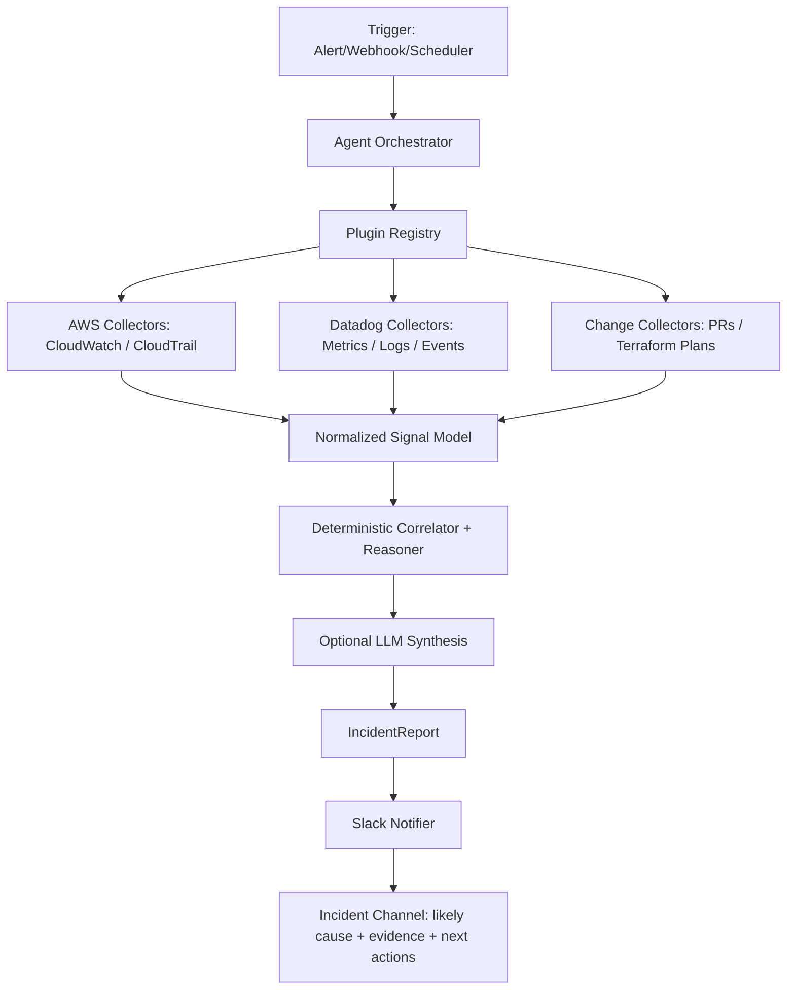
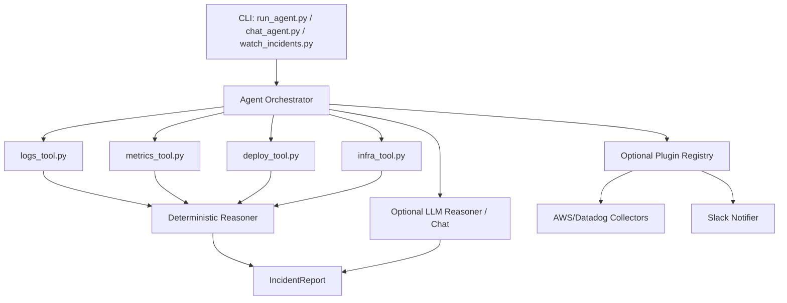

# Infra Sherlock

Infra Sherlock is an AI-powered incident investigation tool for production incident triage.
It correlates cloud telemetry, change signals, and ownership routes, then produces a structured incident report and optional Slack notification.


## Why It Matters

Infra Sherlock is built for two explicit operating modes:

- `cloud` mode: production path using configured collectors/notifiers (no dataset dependency)
- `local` mode: test path using local incident fixtures

Core capabilities:

- Correlates multi-signal telemetry (cloud events, logs, metrics, deploy/change context)
- Produces structured root-cause reports with confidence and timeline
- Supports OpenAI/OpenRouter provider configuration
- Sends optional Slack notifications with dedupe

## Chat Usage

Run interactive chat:

```bash
python cli/chat_agent.py payments_db_timeout
```

`chat_agent.py` runs in AI-only mode and requires LLM credentials in `.env`.

Built-in chat shortcuts:

- `/summary`
- `/root`
- `/timeline`
- `/evidence`
- `/remediation`
- `/help`
- `/exit`
- `/export <file.md>`

## CLI Commands

Cloud investigation report (production path):

```bash
python cli/run_agent.py investigate prod-incident-1 --mode cloud --service-name payments-api
```

Cloud dry-run investigation (no cloud API calls):

```bash
PLUGIN_DRY_RUN=1 python cli/run_agent.py investigate prod-incident-1 --mode cloud --service-name payments-api
```

Local fixture investigation (test/dev path):

```bash
python cli/run_agent.py investigate payments_db_timeout --mode local
```

Major-incident triage:

```bash
python cli/major_incident.py triage payments_sev1_march_2026
```

Major-incident command chat:

```bash
python cli/chat_major_incident.py payments_sev1_march_2026
```

AI-first watch mode (detect -> diagnose -> notify):

```bash
python cli/watch_incidents.py prod-incident-1 --detect-and-notify
```

Dry-run cloud collection preview (no cloud API calls):

```bash
python cli/watch_incidents.py prod-incident-1 --detect-and-notify --dry-run
```

Major-incident chat commands:

- `/overview`
- `/services`
- `/blast-radius`
- `/timeline`
- `/hypotheses`
- `/service <service_name>`
- `/next-steps`
- `/help`
- `/exit`

## AI-Only Runtime Mode

Infra Sherlock now runs in AI-only mode for incident investigation and chat.

- API credentials are required (`OPENAI_API_KEY` or `OPENROUTER_API_KEY`)
- `run_agent.py` and `chat_agent.py` return an error if credentials are missing
- No deterministic fallback is used at runtime for single-incident investigation

Provider configuration is controlled via `.env` (`LLM_PROVIDER=openai|openrouter`).

Cloud connectors and notifications are configured through plugins.

Current cloud connectors:

- AWS CloudWatch plugin: read-only `filter_log_events` collection.
- Datadog plugin: read-only Events API collection.
- Slack notifier: outgoing webhook alerts with dedupe state.

## Major Incident Mode

Major incident mode adds a parent/child incident architecture for cross-team triage:

- Parent incident group (`IncidentGroup`) tracks severity, status, commander, blast radius, and hypotheses.
- Child incidents (`ChildIncident`) represent service-scoped failures with ownership and dependencies.
- Deterministic correlation engine merges timelines, ranks hypotheses, and infers likely initiating fault vs downstream impact.
- Infrastructure-aware correlation attributes suspicious `ChangeEvent` objects and identifies likely failing infrastructure layer.
- Region/AZ-aware blast radius logic distinguishes localized vs broader impact scope.
- Failure-pattern matching maps incidents to known cloud patterns (e.g., `db_connectivity_failure`, `security_group_regression`) with explainable evidence.

### Deterministic Correlation Heuristics

- earliest anomaly receives additional initiating-fault weight
- high-risk infra changes near onset increase root-cause likelihood
- shared dependency failures increase correlation strength
- downstream timeout/upstream symptom patterns reduce root-cause likelihood for later services
- nearby deploys remain alternate hypotheses but do not automatically dominate shared dependency/infra evidence
- region/AZ concentration increases confidence for localized infrastructure faults
- healthy bounded dependency paths reduce assumptions of global/regional outages

Confidence is reported using buckets (`high`, `medium`, `low`) with supporting/contradicting evidence strings.

## Architecture

Real-life / production flow:



Local / test flow (non-production):



## Repository Layout

```text
.
├── LICENSE
├── README.md
├── .env.example
├── requirements.txt
├── assets/
│   └── cli-chat-screenshot.svg
├── cli/
│   ├── chat_agent.py
│   ├── chat_major_incident.py
│   ├── env_utils.py
│   ├── intent_classifier.py
│   ├── major_incident.py
│   ├── response_formatter.py
│   ├── run_agent.py
│   ├── run_mcp_server.py
│   └── watch_incidents.py
├── config/
│   ├── plugins.yaml
│   └── routing.yaml
├── datasets/
│   └── incidents/
│       ├── payments_db_timeout/
│       └── deploy_regression/
├── datasets/
│   └── major_incidents/
│       └── payments_sev1_march_2026/
│           ├── incident_group.json
│           ├── services.json
│           ├── infrastructure.json
│           ├── change_events.json
│           ├── failure_patterns.json
│           ├── child_incidents/
│           └── evidence/
├── incident_agent/
│   ├── agent.py
│   ├── chat.py
│   ├── llm_provider.py
│   ├── notifications/
│   ├── plugins/
│   ├── routing.py
│   ├── major_incident/
│   │   ├── loader.py
│   │   └── correlator.py
│   ├── models.py
│   ├── reasoning/
│   ├── tools/
│   ├── mcp/
│   └── watch.py
├── state/
└── tests/
```

## Setup

```bash
python -m venv .venv
source .venv/bin/activate
pip install -r requirements.txt
```

Environment setup:

```bash
cp .env.example .env
```

Enable cloud plugins (production mode):

```bash
# edit config/plugins.yaml
# mode: cloud
# collectors: [aws_cloudwatch, datadog]
# notifiers: [slack]
```

`run_agent.py investigate` requires explicit mode selection:

```bash
python cli/run_agent.py investigate <incident-id> --mode cloud --service-name <service>
python cli/run_agent.py investigate <fixture-name> --mode local
```

Routing setup for ownership + Slack channels:

```bash
# edit config/routing.yaml
```

## Testing

```bash
pytest -q
```

## MCP Compatibility

Infra Sherlock now includes a real MCP server based on the MCP Python SDK.

Run over stdio:

```bash
python cli/run_mcp_server.py
```

Provided MCP tools:

- `investigate_incident`
- `get_incident_timeline`
- `get_incident_remediation`

Implementation:

- Server: `incident_agent/mcp/server.py`
- Wrapper utilities: `incident_agent/mcp/wrapper.py`

## Example Major-Incident Session

```text
$ python cli/chat_major_incident.py payments_sev1_march_2026
> /overview
SEV1 mitigating: Payment transaction failures across checkout stack
Likely initiating service: payments-api
Top hypothesis: Network/security-group path change degraded DB connectivity

> /services
- payments-api (payments-platform) first=09:58 role=probable cause confidence=high
- checkout-api (checkout-platform) first=10:02 role=downstream confidence=medium
- billing-worker (billing-platform) first=10:06 role=downstream confidence=low
```

## Cloud/SRE Questions This Can Answer

- Which infrastructure layer most likely failed first?
- Which change event is most suspicious near incident onset?
- Is this localized to one region/AZ or broader?
- Is this primarily a service bug or infrastructure fault?
- What is the single fastest validation check to confirm the top hypothesis?

## Suggested GitHub Topics

`python`, `sre`, `devops`, `incident-response`, `observability`, `llm`, `mcp`, `security`

## License

MIT (see `LICENSE`).
