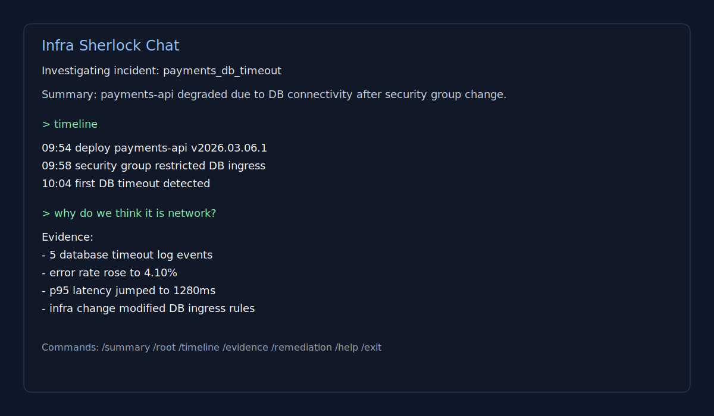

# Infra Sherlock

**AI-powered incident investigation and chat for on-call engineers.**

Infra Sherlock pulls telemetry from your cloud stack (Datadog, AWS CloudWatch, PagerDuty), feeds it to an LLM, and gives you a structured root-cause report — plus an interactive chat session to dig deeper, all from your terminal.



---

## How It Works

```
┌─────────────────────────────────────────────────────────────────────────────┐
│                         INFRA SHERLOCK FLOW                                 │
└─────────────────────────────────────────────────────────────────────────────┘

  TRIGGER                   COLLECT                    REASON                 ACT
  ───────                   ───────                    ──────                 ───

  Alert / Webhook      ┌─► AWS CloudWatch ──────┐
  Scheduler       ─────┤   (logs & events)       │
  Manual CLI           │                         ▼
                       ├─► Datadog ─────────────►  Normalized
                       │   (metrics, events)      │  Evidence
                       │                         │  Model
                       └─► PagerDuty ────────────┘
                           (incidents/alerts)         │
                                                      │
                                                      ▼
                                             ┌─────────────────┐
                                             │   LLM Reasoner  │
                                             │  (OpenAI /      │
                                             │   OpenRouter)   │
                                             └────────┬────────┘
                                                      │
                                          ┌───────────▼───────────┐
                                          │     IncidentReport     │
                                          │  • likely_root_cause   │
                                          │  • confidence score    │
                                          │  • evidence timeline   │
                                          │  • remediation steps   │
                                          └──────┬────────┬────────┘
                                                 │        │
                                    ┌────────────▼─┐  ┌───▼──────────────────┐
                                    │ Slack Notif. │  │  Interactive Chat     │
                                    │ (deduped)    │  │  > what caused this?  │
                                    │              │  │  > /timeline          │
                                    └──────────────┘  │  > /remediation       │
                                                      └──────────────────────┘
```

### Two modes

| Mode | When to use | Data source |
|------|-------------|-------------|
| `cloud` | Production — real incidents | Live APIs (CloudWatch, Datadog, PagerDuty) |
| `local` | Development — no credentials needed | Fixture datasets in `datasets/incidents/` |

---

## Quickstart

### 1. Install

```bash
python -m venv .venv && source .venv/bin/activate
pip install -r requirements.txt

# For cloud collectors (AWS, Datadog, PagerDuty):
pip install -r requirements-cloud.txt
```

### 2. Configure credentials

```bash
cp .env.example .env
```

Edit `.env`:

```bash
# Required — pick one:
OPENAI_API_KEY=sk-...
# or
OPENROUTER_API_KEY=sk-or-...
LLM_PROVIDER=openrouter   # default: openai

# Cloud collectors (optional, needed for cloud mode):
AWS_ACCESS_KEY_ID=...
AWS_SECRET_ACCESS_KEY=...
AWS_DEFAULT_REGION=us-east-1
DD_API_KEY=...
DD_APP_KEY=...
PAGERDUTY_API_KEY=...

# Slack notifier (optional):
SLACK_WEBHOOK_URL=https://hooks.slack.com/...
```

### 3. Configure plugins & routing

`config/plugins.yaml` — enable collectors and notifiers:

```yaml
mode: cloud   # or local for dev/testing

collectors:
  - aws_cloudwatch
  - datadog
  - pagerduty

notifiers:
  - slack
```

`config/routing.yaml` — map services to teams and Slack channels:

```yaml
services:
  payments-api:
    team: payments-platform

teams:
  payments-platform:
    slack_channel: "#payments-incidents"
```

---

## Usage

### Investigate an incident (one-shot report)

```bash
# Cloud mode — hits live APIs
python cli/run_agent.py investigate <incident-id> --mode cloud --service-name payments-api

# Local mode — uses fixture data, no credentials needed
python cli/run_agent.py investigate deploy_regression --mode local
```

### Chat about an incident

Ask follow-up questions in plain English after the initial report:

```bash
python cli/chat_agent.py deploy_regression
```

```
> what caused the spike in error rate?
> /timeline
> /remediation
> /export report.json
```

Available chat commands:

| Command | What it does |
|---------|-------------|
| `/summary` | 2–4 line incident overview |
| `/root` | Most likely root cause |
| `/timeline` | Chronological bullet-point timeline |
| `/evidence` | Strongest supporting evidence |
| `/remediation` | Prioritized fix steps |
| `/export <path>` | Save full report as JSON |
| `/help` | Show all commands |
| `/exit` | Quit |

### Watch mode — detect, diagnose, and notify

Continuously watches for incidents and fires a Slack alert when something is detected:

```bash
python cli/watch_incidents.py <incident-id> --mode cloud --service-name payments-api --detect-and-notify
```

Dry-run (validates plugin wiring, no live API calls):

```bash
PLUGIN_DRY_RUN=1 python cli/watch_incidents.py <incident-id> --mode cloud --service-name payments-api --detect-and-notify --dry-run
```

### MCP server (Claude / AI assistant integration)

Run Infra Sherlock as an MCP server so AI assistants can call it as a tool:

```bash
python cli/run_mcp_server.py
```

Exposed MCP tools:

| Tool | Description |
|------|-------------|
| `investigate_incident` | Full investigation, returns structured report |
| `get_incident_timeline` | Chronological event list only |
| `get_incident_remediation` | Remediation steps only |

---

## What the LLM gets asked

Infra Sherlock never sends raw logs to the LLM. It distills collected signals into a compact evidence payload first:

```json
{
  "incident_name": "payments-db-timeout",
  "service_name": "payments-api",
  "logs": {
    "total_events": 1847,
    "error_events": 312,
    "db_timeout_events": 89,
    "first_timestamp": "2024-01-15T09:42:11Z",
    "last_timestamp": "2024-01-15T10:18:44Z",
    "sample_timeout_messages": ["DB query exceeded 30s timeout..."]
  },
  "metrics": {
    "error_rate_rising": true,
    "peak_error_rate": 0.34,
    "peak_p95_latency_ms": 4820
  },
  "deploys": { "latest_deploy": { "version": "v2.4.1", "timestamp": "..." } },
  "infra_changes": { "high_risk_count": 1 }
}
```

The LLM returns a strict JSON schema validated before use:

```json
{
  "likely_root_cause": "...",
  "confidence": 0.87,
  "key_evidence": ["...", "..."],
  "timeline": [{ "timestamp": "...", "event": "...", "source": "..." }],
  "suggested_remediation": ["...", "..."],
  "next_investigative_steps": ["...", "..."]
}
```

---

## Repository Layout

```
.
├── cli/
│   ├── chat_agent.py          # Interactive incident chat CLI
│   ├── run_agent.py           # One-shot investigation CLI
│   ├── watch_incidents.py     # Watch + notify loop
│   ├── run_mcp_server.py      # MCP server entry point
│   ├── response_formatter.py  # Terminal rendering (Rich)
│   └── env_utils.py           # .env loader
│
├── incident_agent/
│   ├── agent.py               # Orchestrator — wires collection → reasoning → notify
│   ├── chat.py                # Chat session management
│   ├── models.py              # All data models (IncidentReport, LogAnalysis, etc.)
│   ├── llm_provider.py        # OpenAI / OpenRouter client factory
│   ├── routing.py             # Service → team → Slack channel resolution
│   │
│   ├── reasoning/
│   │   └── llm_reasoner.py    # LLM prompt, retry logic, response validation
│   │
│   ├── tools/                 # Deterministic signal parsers (no LLM)
│   │   ├── logs_tool.py       # JSONL log analysis
│   │   ├── metrics_tool.py    # CSV metrics analysis
│   │   ├── deploy_tool.py     # Deploy history parser
│   │   └── infra_tool.py      # Infra change parser
│   │
│   ├── plugins/               # Cloud collector + notifier plugins
│   │   ├── registry.py        # Plugin loader from plugins.yaml
│   │   ├── aws_cloudwatch.py
│   │   ├── pagerduty.py
│   │   └── slack_notifier.py
│   │
│   ├── notifications/
│   │   └── state_store.py     # Alert dedupe (SHA-256 fingerprint + TTL)
│   │
│   └── mcp/
│       ├── server.py          # MCP server implementation
│       └── wrapper.py         # MCP tool wrappers
│
├── config/
│   ├── plugins.yaml           # Enable/disable collectors and notifiers
│   └── routing.yaml           # Service → team → Slack channel map
│
├── integrations/              # Drop-in adapters for org-specific sources
│   ├── aws/
│   ├── cloudtrail/
│   ├── datadog/
│   ├── pagerduty/
│   ├── pull_requests/
│   └── terraform/
│
├── datasets/incidents/        # Fixture data for local mode (dev/testing)
│   ├── deploy_regression/
│   └── payments_db_timeout/
│
├── state/                     # Alert dedupe state (auto-managed)
├── tests/
├── requirements.txt
├── requirements-cloud.txt     # boto3 (AWS)
└── requirements-dev.txt       # pytest
```

---

## Testing

```bash
pip install -r requirements-dev.txt
pytest -q
```

Local mode runs the full investigation pipeline against fixture datasets with no credentials or network access needed.

---

## LLM Provider Support

| Provider | Env var | `LLM_PROVIDER` value |
|----------|---------|----------------------|
| OpenAI | `OPENAI_API_KEY` | `openai` (default) |
| OpenRouter | `OPENROUTER_API_KEY` | `openrouter` |

Switch providers in `.env`:

```bash
LLM_PROVIDER=openrouter
OPENROUTER_API_KEY=sk-or-...
```

---

## License

MIT — see [`LICENSE`](LICENSE).
