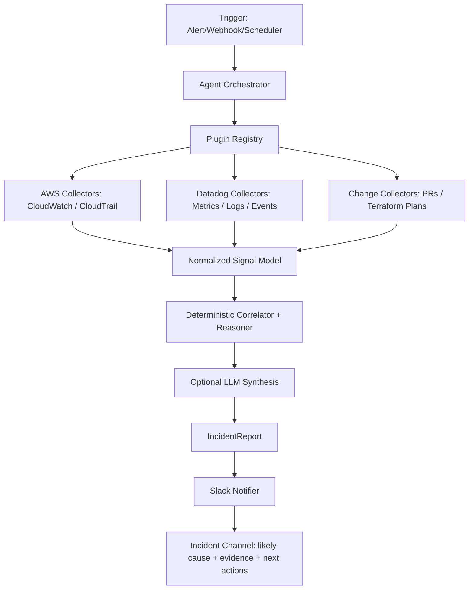

# Infra Sherlock

Infra Sherlock is an AI-powered incident investigation tool for production incident triage.
It correlates cloud telemetry, change signals, and ownership routes, then produces a structured incident report and optional Slack notification.


## Why It Matters

Infra Sherlock is built for two operating modes:

- `cloud` mode: production path using configured collectors/notifiers (no dataset dependency)
- `local` mode: test path for fixture-backed development only

Core capabilities:

- Correlates multi-signal telemetry (cloud events, logs, metrics, deploy/change context)
- Produces structured root-cause reports with confidence and timeline
- Supports OpenAI/OpenRouter provider configuration
- Sends optional Slack notifications with dedupe

## CLI Commands

Cloud investigation report (production path):

```bash
python cli/run_agent.py investigate <incident-id> --mode cloud --service-name <service>
```

Cloud dry-run investigation (no cloud API calls):

```bash
PLUGIN_DRY_RUN=1 python cli/run_agent.py investigate <incident-id> --mode cloud --service-name <service>
```

AI-first watch mode (detect -> diagnose -> notify):

```bash
python cli/watch_incidents.py <incident-id> --detect-and-notify
```

Dry-run cloud collection preview (no cloud API calls):

```bash
python cli/watch_incidents.py <incident-id> --detect-and-notify --dry-run
```

In production, `incident-id` is typically sourced from your alerting/event system
(PagerDuty incident key, Datadog monitor alert ID, internal incident UUID, etc.).

## AI-Only Runtime Mode

Infra Sherlock now runs in AI-only mode for incident investigation and chat.

- API credentials are required (`OPENAI_API_KEY` or `OPENROUTER_API_KEY`)
- `run_agent.py` and `chat_agent.py` return an error if credentials are missing
- No deterministic fallback is used at runtime for single-incident investigation

Provider configuration is controlled via `.env` (`LLM_PROVIDER=openai|openrouter`).

Cloud connectors and notifications are configured through plugins.

Current cloud connectors:

- AWS CloudWatch plugin: read-only `filter_log_events` collection.
- Datadog plugin: read-only Events API collection.
- PagerDuty plugin: incident/alert ingestion for service-scoped production context.
- Slack notifier: outgoing webhook alerts with dedupe state.

## Architecture

Real-life / production flow:



Local mode is retained for testing only and is intentionally not the primary production path.

## Repository Layout

```text
.
├── LICENSE
├── README.md
├── .env.example
├── requirements.txt
├── assets/
│   └── cli-chat-screenshot.svg
├── cli/
│   ├── chat_agent.py
│   ├── env_utils.py
│   ├── response_formatter.py
│   ├── run_agent.py
│   ├── run_mcp_server.py
│   └── watch_incidents.py
├── config/
│   ├── plugins.yaml
│   └── routing.yaml
├── integrations/
│   ├── aws/
│   ├── cloudtrail/
│   ├── datadog/
│   ├── pagerduty/
│   ├── pull_requests/
│   └── terraform/
├── datasets/                  # optional fixture data for local testing only
├── incident_agent/
│   ├── agent.py
│   ├── chat.py
│   ├── llm_provider.py
│   ├── notifications/
│   ├── plugins/
│   ├── routing.py
│   ├── models.py
│   ├── reasoning/
│   ├── tools/
│   ├── mcp/
│   └── watch.py
├── state/
└── tests/
```

## Setup

```bash
python -m venv .venv
source .venv/bin/activate
pip install -r requirements.txt
# optional for cloud collectors:
pip install -r requirements-cloud.txt
# optional for local development/testing:
pip install -r requirements-dev.txt
```

Environment setup:

```bash
cp .env.example .env
```

Enable cloud plugins (production mode):

```bash
# edit config/plugins.yaml
# mode: cloud
# collectors: [aws_cloudwatch, datadog, pagerduty]
# notifiers: [slack]
```

`run_agent.py investigate` requires explicit mode selection:

```bash
python cli/run_agent.py investigate <incident-id> --mode cloud --service-name <service>
```

Use `integrations/` folders to store organization-specific adapters, field mappings,
query templates, and change-source contracts.

Routing setup for ownership + Slack channels:

```bash
# edit config/routing.yaml
```

## Testing

```bash
pytest -q
```

## MCP Compatibility

Infra Sherlock now includes a real MCP server based on the MCP Python SDK.

Run over stdio:

```bash
python cli/run_mcp_server.py
```

Provided MCP tools:

- `investigate_incident`
- `get_incident_timeline`
- `get_incident_remediation`

Implementation:

- Server: `incident_agent/mcp/server.py`
- Wrapper utilities: `incident_agent/mcp/wrapper.py`

## Cloud/SRE Questions This Can Answer

- Which service is currently degrading and why?
- Which cloud/provider events correlate with the incident window?
- What changed recently (deploy/config/infra) near incident onset?
- What is the most likely root cause and the next safest remediation step?

## Suggested GitHub Topics

`python`, `sre`, `devops`, `incident-response`, `observability`, `llm`, `mcp`, `security`

## License

MIT (see `LICENSE`).
